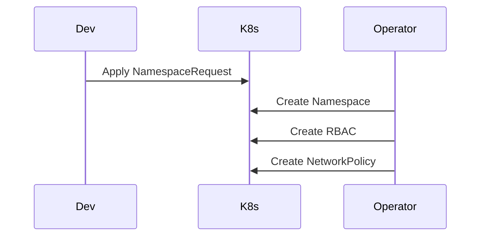

# Architecture: Kubernetes "Golden Path" Provisioner

## System Diagram
The following Mermaid.js sequence diagram maps the core workflow and interactions:

## The Abstraction Gap
Platform engineering is about providing abstractions. A developer should not need to know the intricacies of Kubernetes RBAC, LimitRanges, or NetworkPolicies just to deploy a standard backend API. 

## Operator Design
This project uses the **Operator Pattern** via kubebuilder. 
The custom resource `PlatformService` acts as the API interface for developers.

The reconciliation loop in `platformservice_controller.go` continuously enforces the platform's standard configuration:
- **Namespace Generation**: Isolates the service into `svc-<name>`.
- **Zero-Trust Networking**: Applies a default-deny ingress NetworkPolicy, forcing developers to explicitly whitelist traffic sources.
- **CI/CD RBAC**: Provisions a `ServiceAccount` bounded exactly to the generated namespace with standard `edit` privileges, ensuring least-privilege deployment access.

## Self-Healing
Because this is an Operator (not a Helm chart or Terraform script), if a developer with cluster access manually deletes the NetworkPolicy, the operator will detect the drift and recreate it instantly. This ensures continuous compliance.
