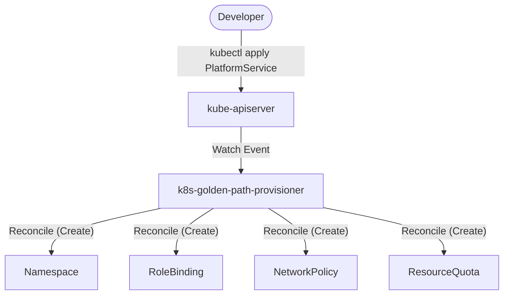

# Architecture — k8s-golden-path-provisioner
> Last updated: 2026-08-29 | Maturity: Full Prototype
> _Kubernetes operator for automated namespace and RBAC provisioning._

## System Diagram
The following Mermaid.js sequence diagram maps the core workflow and interactions:

## Component Table

| Component | File | Responsibility | Tech |
|---|---|---|---|
| PlatformService CRD | `api/v1alpha1/platformservice_types.go` | Defines the API schema for developers | Go |
| Controller | `controllers/platformservice_controller.go` | Main reconciliation loop enforcing state | Go |

## Port Assignments

| Service | Port | Notes |
|---|---|---|
| Metrics | `8080` | Prometheus metrics endpoint exposed by controller-runtime |
| Healthz | `8081` | Liveness and readiness probes |

## Dependency Honesty Table

| Dependency | Status | Notes |
|---|---|---|
| Kubernetes API Server | **Real** | Controller directly talks to the K8s API to manage resources. |
| kind (Local Cluster) | **Optional** | Used for E2E tests and local development. |

## The Abstraction Gap
Platform engineering is about providing abstractions. A developer should not need to know the intricacies of Kubernetes RBAC, LimitRanges, or NetworkPolicies just to deploy a standard backend API. 

## Operator Design
This project uses the **Operator Pattern** via kubebuilder. 
The custom resource `PlatformService` acts as the API interface for developers.

The reconciliation loop in `platformservice_controller.go` continuously enforces the platform's standard configuration:
- **Namespace Generation**: Isolates the service into `svc-<name>`.
- **Zero-Trust Networking**: Applies a default-deny ingress NetworkPolicy, forcing developers to explicitly whitelist traffic sources.
- **CI/CD RBAC**: Provisions a `ServiceAccount` bounded exactly to the generated namespace with standard `edit` privileges, ensuring least-privilege deployment access.

## Self-Healing
Because this is an Operator (not a Helm chart or Terraform script), if a developer with cluster access manually deletes the NetworkPolicy, the operator will detect the drift and recreate it instantly. This ensures continuous compliance.
